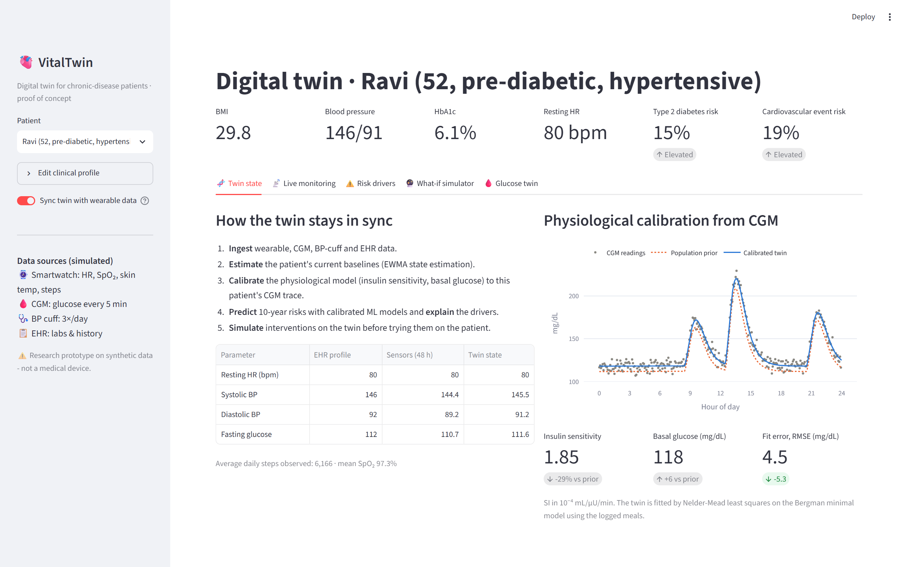
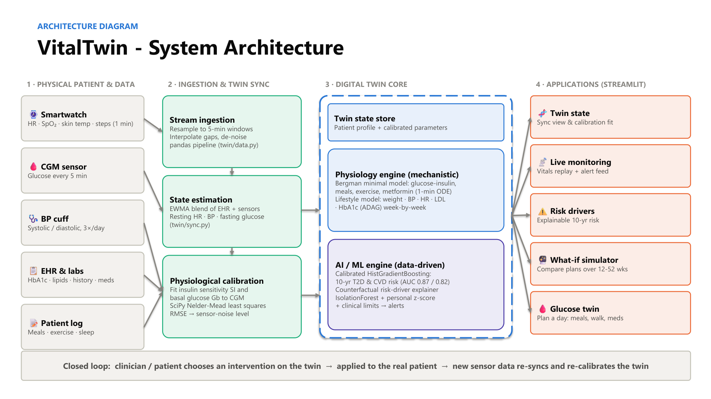

# 🫀 VitalTwin: A Patient Digital Twin for Chronic Disease

> A living virtual replica of a chronic-disease patient. It **syncs** with wearable, CGM and EHR data, **monitors** for deterioration, **predicts** long-term risk with explainable AI and **simulates** interventions before they are tried on the real patient.

Submission for the **Happiest Health Digital Twin Challenge**: proof of concept.



---

## 1. Team details

**Team name:** Nexon

| Role | Name | GitHub |
|---|---|---|
| Team lead & sole member | Anushree Kasturi | [@AnushreeKasturi](https://github.com/AnushreeKasturi) |

## 2. College / Incubator information

- **Institution:** Amrita Vishwa Vidyapeetham, Bengaluru Campus
- **City, State:** Bengaluru, Karnataka, India

## 3. Project title

**VitalTwin: a hybrid physics + AI digital twin for continuous monitoring, risk prediction and what-if simulation in type 2 diabetes and cardiovascular disease.**

## 4. Problem statement

India has more than 100 million people living with diabetes and about 315 million with hypertension (ICMR-INDIAB, *Lancet Diabetes & Endocrinology* 2023). A large share of them are undiagnosed or poorly controlled. Chronic care is still **episodic**: a clinician sees one blood-pressure reading and one HbA1c every few months, while the disease changes every day. Smartwatches and continuous glucose monitors produce rich data, but nothing turns it into a **personal, predictive model of the patient**. As a result:

- deterioration such as hypoglycaemia, tachycardia or desaturation is noticed late;
- patients do not know which of their risk factors matters most;
- treatment and lifestyle plans are trial-and-error, because there is no safe way to ask *"what happens to this patient if…?"* before prescribing.

**Goal:** build a digital twin that mirrors an individual patient, stays synced with their real-world data, and lets patients and clinicians monitor, understand and test interventions virtually.

## 5. Healthcare use case

| User | What VitalTwin does for them |
|---|---|
| **Patient** (pre-diabetic / type 2 diabetic / hypertensive) | Sees their twin and what drives their risk. Plans meals and activity on the glucose twin before eating. |
| **Clinician** | Remote-monitoring dashboard with prioritised critical alerts. Tests therapy and lifestyle plans on the twin, against a no-change baseline, before prescribing. |
| **Care program / insurer / corporate wellness** | Triages members by explainable 10-year risk. Targets preventive outreach. |

**Example journey (demo persona *Ravi*, 52, pre-diabetic hypertensive smoker):**
1. The twin ingests 48 h of smartwatch, CGM and BP-cuff data. It blends them with his EHR values and calibrates his glucose physiology: insulin sensitivity comes out 29 % below the population prior.
2. Live monitoring flags a tachycardia episode, a hyperglycaemic excursion, a night-time SpO₂ dip and a hypoglycaemic event as **critical** alerts.
3. The risk view shows **15 %** 10-year diabetes risk and **19 %** cardiovascular risk. Smoking and systolic BP are his biggest modifiable CVD drivers.
4. In the what-if simulator, the clinician tests a realistic plan: 300 kcal/day deficit, 150 min/week exercise, 2.5 g/day sodium, quitting smoking, 80 % adherence. The twin projects CVD risk falling to about **6 %** and diabetes risk to about **8 %** in 24 weeks.

## 6. Technical stack

| Layer | Technology |
|---|---|
| Language | Python 3.10+ |
| Dashboard / UI | Streamlit, Plotly |
| Numerical simulation | NumPy (ODE integration), SciPy (optimisation) |
| Machine learning | scikit-learn (HistGradientBoosting, CalibratedClassifierCV, IsolationForest) |
| Data handling | pandas |
| Model persistence | joblib |
| Testing | pytest |
| Docs generation | python-pptx (architecture diagram and presentation) |

### Architecture



Full diagram: [`docs/Architecture_Diagram.pdf`](docs/Architecture_Diagram.pdf) · [`.pptx`](docs/Architecture_Diagram.pptx)

```
Physical patient & data         Ingestion & twin sync            Digital twin core                         Applications
───────────────────────         ─────────────────────            ─────────────────                         ────────────
Smartwatch (HR, SpO₂, temp) ─┐  Stream ingestion (5-min windows)  Twin state store                          Twin state view
CGM (glucose / 5 min)       ─┼─▶ State estimation (EWMA)      ─▶  Physiology engine (Bergman ODE,       ─▶  Live monitoring + alerts
BP cuff (3×/day)            ─┤  Physiological calibration         lifestyle projection)                     Explainable risk drivers
EHR & labs                  ─┤  (SciPy least squares)             AI/ML engine (risk models, explainer,     What-if simulator
Patient log (meals, sleep)  ─┘                                    anomaly detection)                        Glucose twin
        ▲                                                                                                       │
        └────────────── intervention chosen on the twin is applied to the real patient ◀───────────────────────┘
```

### Repository structure

```
health-digital-twin/
├── app.py                  # Streamlit dashboard (5 views)
├── train.py                # trains & evaluates the risk models
├── twin/
│   ├── patient.py          # patient profile (twin state) + demo personas
│   ├── physiology.py       # Bergman minimal model, lifestyle projection, CGM metrics
│   ├── data.py             # synthetic cohort + wearable/CGM stream generator
│   ├── models.py           # risk models, counterfactual explainer, anomaly monitor
│   └── sync.py             # state estimation + physiological calibration
├── tests/test_twin.py      # 10 automated tests
├── models/metrics.json     # evaluation results
└── docs/
    ├── Architecture_Diagram.pdf / .pptx
    ├── VitalTwin_Presentation.pdf / .pptx
    ├── DEMO_SCRIPT.md
    ├── build_docs.py       # regenerates the decks
    └── screenshots/
```

### Run it locally

```bash
git clone https://github.com/AnushreeKasturi/health-digital-twin.git
cd health-digital-twin
python -m venv .venv && source .venv/bin/activate   # Windows: .venv\Scripts\activate
pip install -r requirements.txt
python train.py            # optional: the app trains on first launch (~30 s)
streamlit run app.py       # opens http://localhost:8501
pytest -q                  # 10 tests
```

## 7. AI/ML model and framework details

VitalTwin is a **hybrid twin**. Mechanistic models give physiologically plausible, explainable simulations from little data. ML models learn population risk patterns that equations miss.

| Component | Method | Framework | Result (synthetic data) |
|---|---|---|---|
| 10-year type 2 diabetes risk | `HistGradientBoostingClassifier` + isotonic calibration (`CalibratedClassifierCV`, 3-fold) on 16 features | scikit-learn | **AUC 0.868**, Brier 0.030 |
| 10-year cardiovascular-event risk | Same architecture | scikit-learn | **AUC 0.818**, Brier 0.047 |
| Risk explanation | Counterfactual attribution: each modifiable factor is set to a healthy target and the risk change is measured | custom | Ranked, actionable drivers per patient |
| Anomaly detection | `IsolationForest` fitted on the patient's own 3-day baseline, plus personal ±3 SD z-scores, plus clinical hard limits, with 30-min alert de-duplication | scikit-learn | 4/4 injected events detected; ≤1 critical alert on clean data |
| Glucose physiology | Bergman minimal model (glucose / remote insulin / plasma insulin) with gut-absorption meal input, exercise uptake and a metformin effect; Euler integration at 1-min steps | NumPy | Uncalibrated estimated HbA1c within 0.3 % of each persona's lab value |
| Twin calibration | Nelder-Mead least squares on insulin sensitivity (SI) and basal glucose (Gb) against CGM, with a weak prior | SciPy | Recovers hidden SI to within ~2 %; RMSE falls to the sensor-noise level (~4.5 mg/dL) |
| State estimation | Exponentially weighted blend of EHR values and sensor-derived resting HR, BP and fasting glucose | pandas | |
| Lifestyle projection | Week-by-week effect-size model (weight, BP, resting HR, LDL/HDL, insulin sensitivity), with gradual habit adoption and adherence. HbA1c is driven by the ODE's mean glucose via the ADAG equation, with RBC-turnover lag | NumPy | 12-52 week scenarios vs no change |

**Features used by the risk models:** age, sex, BMI, systolic/diastolic BP, resting HR, fasting glucose, HbA1c, LDL, HDL, smoking, family history of diabetes, exercise min/week, sleep hours, sodium g/day, BP medication.

**Training data:** a 20,000-person **synthetic** cohort (`twin/data.py`, 80/20 stratified split). Outcomes are sampled from logistic models with FINDRISC / ADA (diabetes) and Framingham (CVD) style risk factors plus non-linear interactions. **No real patient data is used.** The pipeline (`train.py`) can be retrained unchanged on a real tabular cohort such as NHANES, UK Biobank or hospital EHR extracts.

**Model assumptions (effect sizes, simplified from the literature):** ~7,700 kcal per kg of body weight with metabolic adaptation; about −1 mmHg SBP per kg lost; about −2.5 mmHg per g/day sodium reduction (DASH-Sodium); about −5 mmHg for 150 min/week aerobic exercise; about −10 mmHg for an antihypertensive; about −35 % LDL for a moderate-intensity statin; metformin ×1.25 insulin sensitivity. HbA1c uses the ADAG equation (eAG = 28.7 × A1c − 46.7). CGM targets follow the international consensus range of 70-180 mg/dL.

> ⚠️ **Disclaimer:** VitalTwin is a research proof of concept built on synthetic data. It is not a medical device and must not be used for diagnosis or treatment decisions.

## 8. Demo video

📺 **Demo video (15-20 min, unlisted YouTube):** [ADD UNLISTED YOUTUBE LINK HERE]

A suggested recording script is in [`docs/DEMO_SCRIPT.md`](docs/DEMO_SCRIPT.md).

## 9. Open-source license

This project is released under the **MIT License**; see [`LICENSE`](LICENSE).
Third-party libraries keep their own licenses: Streamlit (Apache 2.0), Plotly (MIT), NumPy / SciPy / pandas / scikit-learn / joblib (BSD-3-Clause), pytest (MIT), python-pptx (MIT).

## 10. Architecture diagram (PDF/PPT)

- [`docs/Architecture_Diagram.pdf`](docs/Architecture_Diagram.pdf)
- [`docs/Architecture_Diagram.pptx`](docs/Architecture_Diagram.pptx)

## 11. Presentation (PDF/PPT)

- [`docs/VitalTwin_Presentation.pdf`](docs/VitalTwin_Presentation.pdf)
- [`docs/VitalTwin_Presentation.pptx`](docs/VitalTwin_Presentation.pptx)

The deck covers the problem, use case, solution, architecture, AI/ML details, a walkthrough of all five screens, outcomes, limitations and roadmap.

## 12. Outcomes

- A working end-to-end twin that syncs, monitors, predicts, explains and simulates in one interactive app.
- Physiologically grounded: simulated HbA1c matches lab values before calibration; calibration recovers hidden patient physiology.
- Actionable: interventions are compared against no change over 12-52 weeks, accounting for adherence.
- Tested: 10 automated tests cover physiology, calibration, ML ranking and anomaly detection.

## 13. Limitations and roadmap

| Limitation today | Next step |
|---|---|
| Synthetic training cohort | Retrain on NHANES / ICMR-INDIAB / partner-hospital EHR data and validate externally |
| Simulated sensor streams | Integrate Health Connect, HealthKit and CGM vendor APIs, plus FHIR for EHR |
| Point estimates | Bayesian / Kalman twin updating with uncertainty bands |
| Single-patient view | Clinician multi-patient triage dashboard |
| Glucose and cardiometabolic only | Add cardiac (HRV / ECG) and renal sub-models |
| Not clinically validated | Prospective validation study with a clinical partner |

## 14. Accessibility of files and links

All code, documents and screenshots are in this public repository, and none need sign-in. The demo video is an **unlisted** (not private) YouTube video, so anyone with the link can watch it.
